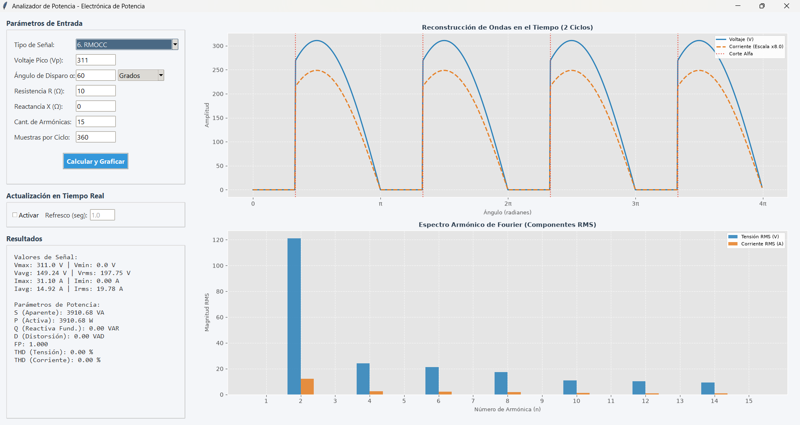

# Analizador de Potencia - Electrónica de Potencia

## Descripción
Sistema de simulación, análisis y visualización de parámetros eléctricos y de calidad de energía (P, S, Q, D, FP, THD) diseñado para convertidores estáticos de potencia (rectificadores monofásicos y trifásicos, controlados y no controlados, e inversores). 

El núcleo de cálculo realiza el procesamiento de señales mediante correlación estricta de la Serie Trigonométrica de Fourier (sin depender de FFT), lo que le otorga alta precisión y eficiencia para operar en tiempo real o ser embebido en microcontroladores (como ESP32 u otros sistemas de adquisición por ADC).



---

## Arquitectura del Proyecto (MVC)
El software está estructurado bajo el patrón **Modelo-Vista-Controlador**:
- **Modelo ([calculos.py](calculos.py)):** Motor matemático puro implementado en NumPy. Genera las formas de onda de tensión, modela la respuesta temporal y armónica para cargas de impedancia compleja ($R$ y $X$), descompone en coeficientes de Fourier y calcula parámetros de potencia según el estándar IEEE 1459.
- **Vista ([interfaz.py](interfaz.py)):** Interfaz gráfica interactiva desarrollada con Tkinter y Matplotlib. Dispone de controles de entrada, ajuste de unidades (grados/radianes), modo de actualización en tiempo real y visualización en doble subplot vertical.
- **Controlador ([main.py](main.py)):** Punto de entrada y gestión del ciclo de vida de la aplicación.

---

## Tipos de Señales Soportadas
El analizador cuenta con una biblioteca de 12 señales estandarizadas:

1. **0. Senoidal:** Señal senoidal pura $V_p \sin(\theta)$.
2. **1. Cuadrada:** Onda simétrica bipolar con transiciones abruptas.
3. **2. Cuasi-cuadrada:** Pulso con muescas regulables mediante el ángulo de disparo $\alpha$.
4. **3. RMMO:** Rectificador Monofásico de Media Onda no controlado ($V_p \sin(\theta)$ en $[0, \pi)$ y $0$ en $[\pi, 2\pi)$).
5. **4. RMMOC:** Rectificador Monofásico de Media Onda Controlado ($0$ en $[0, \alpha)$, $V_p \sin(\theta)$ en $[\alpha, \pi)$ y $0$ en $[\pi, 2\pi)$).
6. **5. RMOC:** Rectificador Monofásico de Onda Completa no controlado ($|V_p \sin(\theta)|$).
7. **6. RMOCC:** Rectificador Monofásico de Onda Completa Controlado (puente de tiristores con control de fase $\alpha$).
8. **7. RTMO:** Rectificador Trifásico de Media Onda no controlado (conmutación natural de las 3 fases en $\pi/6$).
9. **8. RTMOC:** Rectificador Trifásico de Media Onda Controlado (retardo $\alpha$ desde el punto de conmutación natural en $\pi/6$).
10. **9. RTOC:** Rectificador Trifásico de Onda Completa / Puente de Graetz de 6 pulsos (envolvente máxima de las tensiones de línea compuestas).
11. **10. RTOCC:** Rectificador Trifásico de Onda Completa Controlado (puente de 6 tiristores con retardo $\alpha$ desde la conmutación natural de las líneas).
12. **11. Muestras ADC (Simuladas):** Simulación de entrada analógica con ruido gaussiano añadido, preparada para contrastar algoritmos de filtrado e instrumentación.

---

## Capacidades y Cálculos Implementados
- **Parámetros Estadísticos de Señal:** Tensión y corriente pico, mínima, media y eficaz ($V_{\max}, V_{\min}, V_{\text{avg}}, V_{\text{rms}}, I_{\max}, I_{\min}, I_{\text{avg}}, I_{\text{rms}}$).
- **Potencias según IEEE 1459:**
  - Potencia Aparente ($S$).
  - Potencia Activa ($P$).
  - Potencia Reactiva Fundamental ($Q$).
  - Potencia de Distorsión armónica ($D$).
  - Factor de Potencia total ($FP = P/S$).
- **Distorsión Armónica Total (THD):**
  - $\text{THD}_V$ (Tensión) y $\text{THD}_I$ (Corriente) con algoritmos protegidos contra divisiones por cero o ruido de punto flotante en ausencia de fundamental.
- **Modelado de Impedancias Complejas:**
  - Carga puramente resistiva ($X = 0\,\Omega$).
  - Carga inductiva ($X > 0\,\Omega$, con $X_n = nX$).
  - Carga capacitiva ($X < 0\,\Omega$, con $X_n = X/n$).
- **Espectro Armónico de Fourier:** Extracción y graficado de las amplitudes eficaces (RMS) de cada armónica individual ($n = 1 \dots N$).
- **Visualización Doble (Subplots Matplotlib):**
  - **Subplot Superior:** Reconstrucción temporal de tensión y corriente (escalada dinámicamente) para 2 ciclos completos, con líneas verticales de referencia para los instantes de disparo $\alpha$.
  - **Subplot Inferior:** Espectro de barras lado a lado comparando las componentes armónicas RMS de tensión y corriente por orden armónico.
- **Cursores Interactivos y Anotaciones al Clic:**
  - Inspección dinámica de valores haciendo clic sobre cualquiera de los dos gráficos.
  - En el dominio temporal: Muestra el ángulo exacto ($\text{rad}$) y la amplitud correspondiente ($\text{V}$ o $\text{A}$).
  - En el espectro armónico: Identifica el número de armónica ($n$) y su magnitud eficaz ($\text{RMS}$).
  - Etiquetas flotantes estilizadas con directriz y eliminación automática del punto anterior para evitar superposiciones, sincronizadas con el bucle de actualización en tiempo real.
- **Modo en Tiempo Real:** Bucle configurable en segundos para simulación continua o monitoreo de variables en vivo.

---

## Instalación y Uso

1. **Clonar el repositorio:**
   ```bash
   git clone https://github.com/EliasUpstein/InverRect-Monitor.git
   cd InverRect-Monitor
   ```

2. **Crear y activar un entorno virtual (recomendado):**
   ```bash
   python -m venv venv
   # En Windows:
   venv\Scripts\activate
   # En Linux/Mac:
   source venv/bin/activate
   ```

3. **Instalar dependencias:**
   ```bash
   pip install numpy matplotlib
   ```

4. **Ejecutar la aplicación:**
   ```bash
   python main.py
   ```
